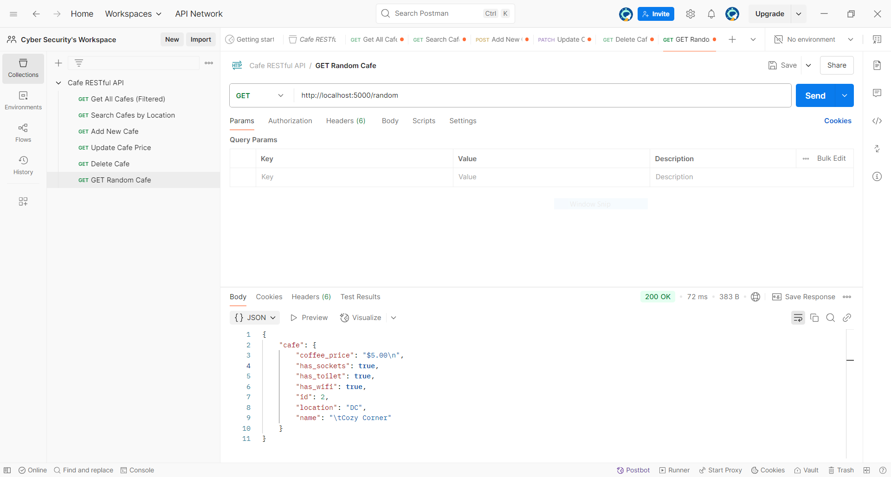
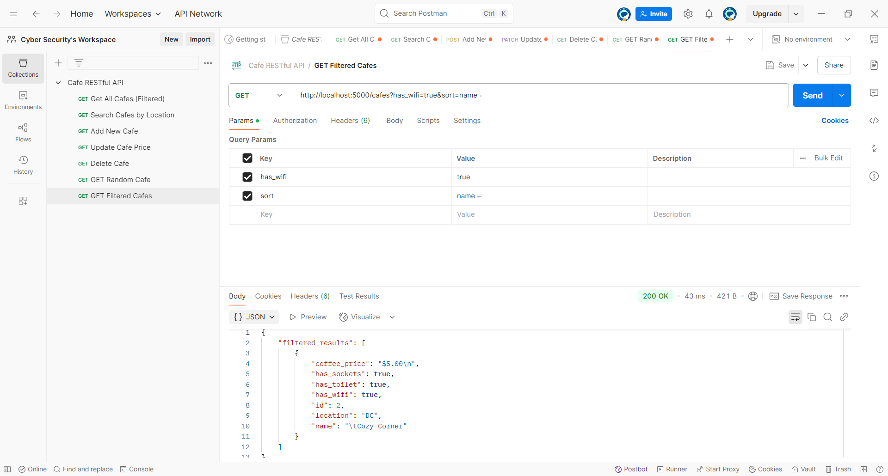
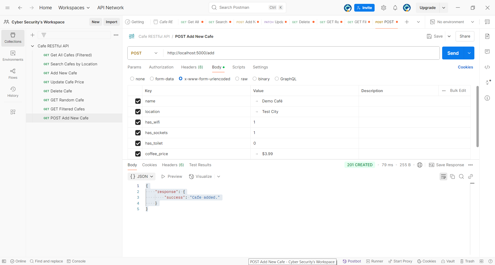
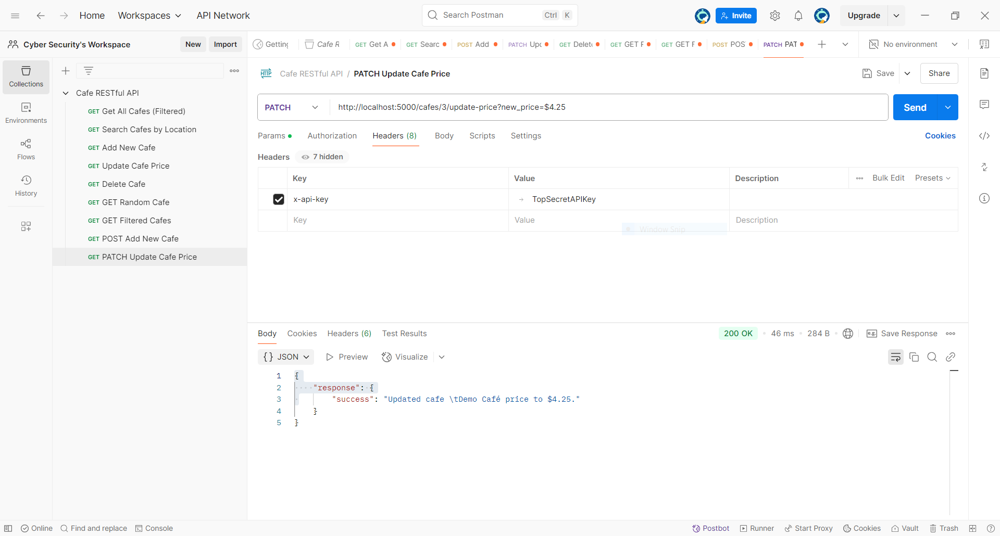
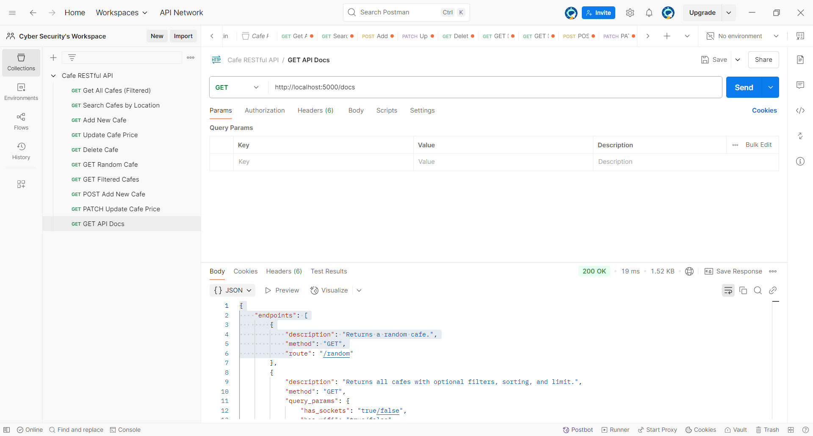

# ☕ Cafe RESTful API

A professional, secure, and fully-documented RESTful API for managing cafes — complete with filtering, authentication, and Postman collection support.

---

## 📖 Overview

This project is a backend-only Flask application designed to simulate a real-world café listing API. Users can add new cafes, filter by features (Wi-Fi, sockets, etc.), and perform secure updates or deletions using API key authentication. The API is fully documented, Postman-tested, and structured for scalability with Blueprints and modular architecture.

---

## 📸 Screenshots

| Endpoint | Description |
|----------|-------------|
|  | `GET /random` – returns a random cafe |
|  | `GET /cafes?has_wifi=true&sort=name` – filters cafes |
|  | `POST /add` – adds a new cafe |
|  | `PATCH /cafes/<id>/update-price` – updates price with API key |
|  | `GET /docs` – static API documentation in JSON |

---

## 🚀 Features

- ✅ Modular Flask app using Blueprints and application factory pattern
- ✅ Full CRUD functionality with SQLite and SQLAlchemy
- ✅ Filtering, sorting, and limit options for flexible queries
- ✅ API key-protected PATCH and DELETE routes
- ✅ JSON-based static API docs at `/docs`
- ✅ Fully CORS-compatible for frontend integrations
- ✅ Postman-tested and ready to demo

---

## 🛠️ Tech Stack

- **Language:** Python 3.12
- **Framework:** Flask, Flask-Restful
- **Database:** SQLite via SQLAlchemy
- **Security:** API key via request headers
- **Testing & Docs:** Postman
- **Other:** Flask-CORS, python-dotenv

---

## 🧠 What I Learned

- How to build and structure scalable REST APIs using Flask
- Managing route protection with custom API key auth
- Building self-documenting JSON API docs
- Filtering and sorting techniques in SQLAlchemy
- Testing, organizing, and documenting endpoints with Postman
- Clean modular design using Blueprints

---

## 📁 Project Structure

```
restful_api_project/
│
├── app/
│   ├── __init__.py
│   ├── models.py
│   ├── routes/
│   │   └── cafes.py
│   └── utils/
│       └── auth.py
│
├── run.py
├── .env.example
├── requirements.txt
├── cafes.db
└── cafe-api.postman_collection.json
```

---

## 🧪 How to Run Locally

```bash
# 1. Create and activate virtual environment
python -m venv venv
venv\Scripts\activate         # or source venv/bin/activate

# 2. Install dependencies
pip install -r requirements.txt

# 3. Set up environment variables
cp .env.example .env            # Then edit .env if needed

# 4. Run the app
python run.py
```

Visit endpoints like:
- `http://localhost:5000/random`
- `http://localhost:5000/cafes?has_wifi=true&sort=name`
- `http://localhost:5000/docs`

---

## 📦 Postman Collection

Use the included collection to test every route:

```
cafe-api.postman_collection.json
```

> Includes all endpoints, including secure ones preconfigured with headers and params.

---

## 📄 API Documentation

A full JSON-based reference is available by visiting:

```
http://localhost:5000/docs
```

No need for external docs — everything is documented in-app.

---

## 🔐 Secure Endpoints

The following routes require an API key in the request headers:

- `PATCH /cafes/<id>/update-price`
- `DELETE /cafes/<id>`

Include this in your request headers:
```
x-api-key: TopSecretAPIKey
```

---

## 🔮 Future Improvements

- Add pagination for long results
- Convert static docs to Swagger/OpenAPI
- Add user authentication and ownership per cafe
- Replace API key with token-based JWT auth
- Deploy to Render or Fly.io with PostgreSQL

---

## ✅ Project Status

✨ Project Complete and Production-Ready  
🔐 Secure routes + built-in docs  
📥 Postman collection included  
📂 Clean architecture for future upgrades